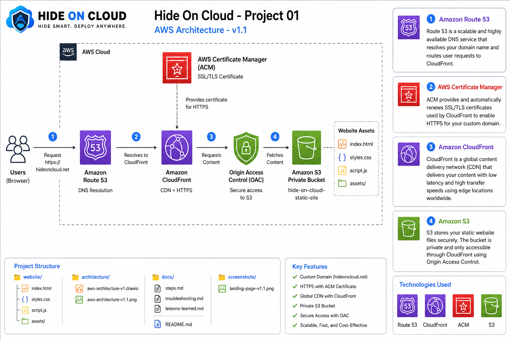

# ☁️ Hide On Cloud

> **Project 01 — Secure Static Website on AWS**

A secure static website deployed on AWS using Amazon S3, CloudFront, Route 53, ACM, and Origin Access Control (OAC).

---

## Overview

**Hide On Cloud** is the first project in my AWS Cloud Portfolio.

This project demonstrates how to deploy a production-style static website using AWS best practices, including a private Amazon S3 bucket, CloudFront CDN, HTTPS, a custom domain, and secure origin access.

---

## Live Demo

🌐 https://hideoncloud.net

---

## Architecture



---


## AWS Services

- Amazon S3
- Amazon CloudFront
- Amazon Route 53
- AWS Certificate Manager (ACM)
- Origin Access Control (OAC)

---

## Current Version

**v1.1**

### Features

- Static Website Hosting
- Private Amazon S3 Bucket
- Amazon CloudFront CDN
- Origin Access Control (OAC)
- Custom Domain (`hideoncloud.net`)
- HTTPS with AWS Certificate Manager
- DNS Resolution with Amazon Route 53

---

## Roadmap

- [x] Static Website
- [x] Private Amazon S3 Bucket
- [x] CloudFront Distribution
- [x] Origin Access Control (OAC)
- [x] Custom Domain
- [x] HTTPS (ACM)
- [x] Route 53 DNS
- [ ] CI/CD with GitHub Actions
- [ ] Infrastructure as Code (Terraform)

---

## Project Structure

```text
.
├── website/
├── architecture/
├── screenshots/
├── docs/
└── README.md
```

---

## Author

**Lowenskin Santana**

GitHub: https://github.com/Sleitter